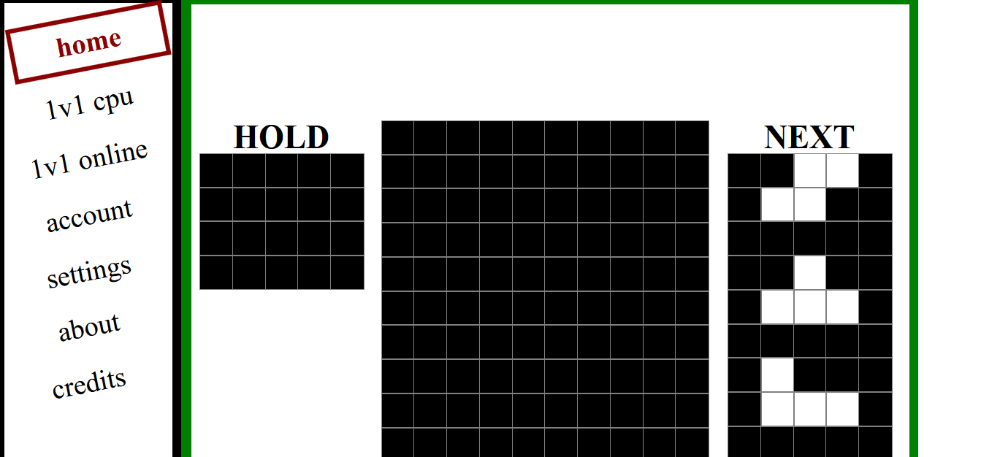

# HOW TO COMPILE

- install "rustup" and "nodejs"
- install "vscode" including "rust-analyzer" plugin
- install "git for windows" including "bash"
- install "sass" using npm: `npm install -g sass`
- run commands in vscode bash terminal


```
rustup default stable
rustup update stable
rustup target add wasm32-unknown-unknown

cargo install cargo-binstall
cargo binstall trunk
cargo binstall wasm-bindgen-cli --no-confirm
cargo binstall wasm-pack --no-confirm
cargo binstall cargo-leptos --no-confirm
cargo binstall leptosfmt --no-confirm
cargo binstall cargo-watch --no-confirm
cargo install -f cargo-binutils
rustup component add llvm-tools-preview


bash test.sh
bash run-server.sh
```


# todo
- SINGLEPLAYE$R: TIMER  + 40 LINE WORLD RECCORD + BLIETZ + "PUZZLE MODE"

- change all Get* api message to return None for "not found" -- is not error (custom game / mmspaint on randomm name);
- https://github.com/goldfire/howler.js/tree/master/examples/sprite
- rotate tests fromm mwiki
  - finesse https://harddrop.com/wiki/0G_60_Hz_SRS_Movement_Finesse
  - SRS https://tetris.fandom.com/wiki/SRS

### feature = singleplayer

- leaderboard + world record
- combo + TSPIN + Score


### 1V1 ONLINE

- Combo GARBAGE - bara + send lines


## grafic

- singleplayer - make window centered
- hold / next: each pcs has its own centered board


### whatever

  